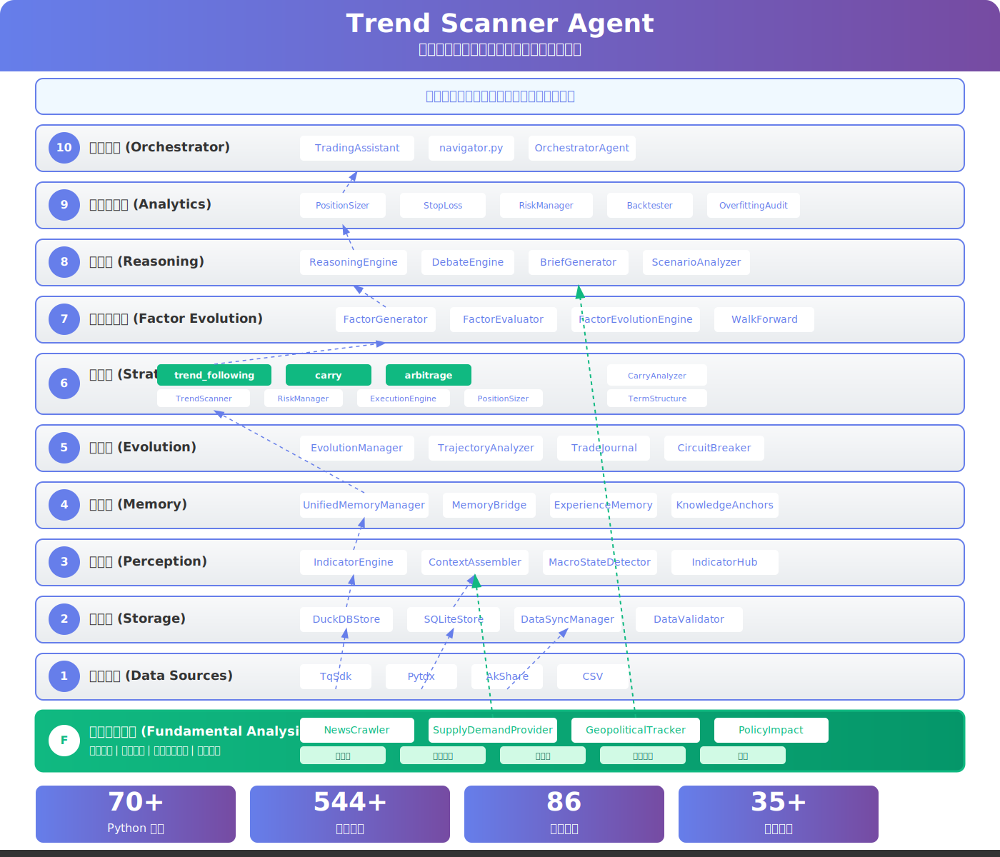

# QuantNova

> 推理重于规则的期货趋势跟踪决策辅助系统 - 多策略交易智能体

**新用户请查看 [用户手册](docs/USER_GUIDE.md)** | **版本历史见 [CHANGELOG](docs/CHANGELOG.md)** | **架构总览见 [系统架构](docs/system_architecture_overview.md)**

## 一句话概括

QuantNova 是一个融合趋势跟踪、因子进化、强化学习的多策略交易智能体，通过 LLM 推理和自然语言交互，为期货交易提供智能决策支持。系统不自动下单，只输出决策简报供人参考。

## 核心理念

**以人为本，推理为魂，规则为果。**

所有看似"规则"的内容（止损、仓位、入场条件）均由推理层根据当前市场状态动态生成，而非事先写死。

---

## 快速开始

```bash
git clone https://github.com/CTAAgents/QuantNova.git
cd QuantNova
pip install -r requirements.txt

# 数据同步（首次使用必须执行）
python tools/core/sync_data.py sync --days 120

# 运行扫描
python tools/core/scan_opportunities.py --output text --save

# 自然语言交互
python scripts/core/nlp/nlp_chat.py

# Reasoner深度分析（推荐）
python tools/core/scan_opportunities.py --reasoner --output text --save

# 持仓健康度评估
python tools/core/scan_opportunities.py --position-health

# 因子进化
python tools/core/scan_opportunities.py --evolve --evolve-rounds 5
```

---

## 系统架构



### 分层架构（11层 + 跨层模块）

```
┌─────────────────────────────────────────────────────────────────────┐
│ Layer 10 - 主协调层 (Orchestrator)                                   │
│   TradingAssistant + MainProcess + EventEngine + Workers + NLP      │
├─────────────────────────────────────────────────────────────────────┤
│ Layer 9 - 分析工具层 (Analytics)                                     │
│   PositionSizer + StopLoss + RiskManager + Backtester + Health     │
├─────────────────────────────────────────────────────────────────────┤
│ Layer 8 - 高级分析层 (Advanced Analysis)                             │
│   KnowledgeAnchors + VisibilityGraph + RegimeSegmenter + DataValid │
├─────────────────────────────────────────────────────────────────────┤
│ Layer 7 - 因子进化层 (Factor Evolution)                              │
│   FactorGenerator → FactorEvaluator → FactorGate → Evolver         │
│   + FactorValidator + FactorLifecycle + FactorGovernance            │
├─────────────────────────────────────────────────────────────────────┤
│ Layer 6 - 进化层 (Evolution)                                         │
│   EvolutionManager + TrajectoryAnalyzer + CircuitBreaker + Meta    │
├─────────────────────────────────────────────────────────────────────┤
│ Layer 5 - 策略层 (Strategy)                                          │
│   TrendScanner + Carry + Arbitrage + RiskManager + Execution       │
├─────────────────────────────────────────────────────────────────────┤
│ Layer 4 - 推理层 (Reasoning)                                         │
│   ReasoningEngine(LLM推理) + DebateEngine(鹰鸽辩论) + Scenario     │
├─────────────────────────────────────────────────────────────────────┤
│ Layer 3 - 记忆层 (Memory)                                            │
│   UnifiedMemoryManager + MemoryBridge + ExperienceMemory + Vector  │
├─────────────────────────────────────────────────────────────────────┤
│ Layer 2 - 存储层 (Storage)                                           │
│   DuckDBStore + SQLiteStore + DataSync + TqSdkBridge + DataRouter  │
├─────────────────────────────────────────────────────────────────────┤
│ Layer 1 - 感知层 (Perception)                                        │
│   IndicatorEngine(自研35+指标+TqSdk内置70+指标+7维趋势强度)          │
│   + ContextAssembler + MultiDimensionScreener + MacroState           │
│   + 基本面分析(国际/国内新闻源)                                     │
├─────────────────────────────────────────────────────────────────────┤
│ Layer 0 - 数据模型层 (Foundation)                                    │
│   models.py + TrendScannerConfig + ControlVariable                  │
└─────────────────────────────────────────────────────────────────────┘

跨层模块:
  RL模块 (8个) → Layer 5(信号) + Layer 7(Walk-Forward) + Layer 8(接口) + Layer 10
  NLP模块 (7个) → Layer 1(命令解析) + Layer 10(LLM对话)
  Tools工具集 (10+个) → CLI入口脚本
```

### 核心数据流

| 数据流 | 方向 | 说明 |
|--------|------|------|
| 数据源 → 存储层 | ↑ | 原始行情写入 DuckDB（自动回写） |
| 存储层 → 感知层 | ↑ | K线数据供指标计算 |
| 感知层 → 记忆层 | ↑ | 技术指标+基本面存入记忆 |
| 记忆层 → 推理层 | ↑ | 历史经验供LLM推理参考 |
| 推理层 → 策略层 | ↑ | 推理结论指导策略信号 |
| 策略层 → 进化层 | ↔ | 策略表现反馈，因子有效性验证 |
| 进化层 → 记忆层 | ↔ | 经验教训存储，历史经验查询 |
| 各层 → 主协调层 | ↑ | TradingAssistant 调度全流程 |

### 独立策略模块

```
scripts/strategies/
├── trend_following/      # 趋势跟踪（3层融合：Z-score→MAD→加权评分）
│   ├── scanner.py        # TrendScanner
│   └── strategy.py       # StrategyPool
├── carry/                # Carry 策略（期限结构套利）
│   └── carry_analyzer.py # CarryAnalyzer（Contango/Backwardation展期收益）
├── arbitrage/            # 套利策略（跨期/跨品种）
│   └── arbitrage_analyzer.py
└── strategy_portfolio.py # 多策略组合管理
```

### 风险评估模块（Algometrics 论文实现）

```
scripts/risk/
├── crowding_detector.py  # 拥挤度检测
│   ├── CrowdingDetector  # 检测信号拥挤度
│   ├── CrowdingMetrics   # 拥挤度指标
│   └── CrowdingLevel     # 拥挤度等级 (LOW/MEDIUM/HIGH/CRITICAL)
└── deployment_risk.py    # 部署风险评估
    ├── DeploymentRiskEstimator  # 估算部署风险 vs 历史风险
    └── RiskAssessment    # 风险评估结果
```

**基于论文**：[Algometrics: Forecasting Under Algorithmic Feedback](https://arxiv.org/abs/2605.23978)

**核心思想**：
- 历史风险 ≠ 部署风险（回测表现 ≠ 实盘表现）
- 拥挤效应会导致历史排名反转
- 需要报告反馈敏感性

### 设计原则

| 原则 | 含义 |
|------|------|
| 推理重于规则 | 所有"规则"由推理层动态生成 |
| 计算用脚本，推理用 Agent | 确定性计算不调 LLM |
| 数据本地化 | TqSdk 数据写入本地 DuckDB |
| 因子即代码 | 因子是 LLM 生成的可执行代码 |
| 门控不可调 | 门控阈值预设，防 p-hacking |
| 技术面+基本面融合 | 技术指标提供时机，基本面提供方向 |
| 事件驱动 | 重大事件优先于技术信号 |

---

## CLI 使用手册

### 主入口：scan_opportunities.py

```bash
python tools/core/scan_opportunities.py [选项]
```

| 参数 | 说明 | 示例 |
|------|------|------|
| `--symbols` | 指定品种 | `--symbols RB,I,JM` |
| `--output` | 输出格式 | `--output text` |
| `--reasoner` | Reasoner深度分析 | `--reasoner` |
| `--use-rl` | 启用 RL 信号 | `--use-rl` |
| `--evaluate-factors` | 因子评估 | `--evaluate-factors` |
| `--evolve` | 因子进化 | `--evolve --evolve-rounds 5` |
| `--position-health` | 持仓健康度 | `--position-health` |
| `--arbitrage` | 套利分析 | `--arbitrage` |
| `--health-check` | 策略健康度 | `--health-check` |

### 常用命令

```bash
# 日常扫描
python tools/core/scan_opportunities.py --output text --save

# Reasoner深度分析（推荐）
python tools/core/scan_opportunities.py --reasoner --output text --save

# 指定品种 + Reasoner
python tools/core/scan_opportunities.py --symbols RB,I,JM --reasoner --output text

# 使用 RL 信号扫描（需要先训练模型）
python tools/core/scan_opportunities.py --use-rl

# 因子进化（手动触发）
python tools/core/scan_opportunities.py --evolve --evolve-rounds 5

# 套利分析
python tools/core/scan_opportunities.py --arbitrage --output text

# 持仓健康度
python tools/core/scan_opportunities.py --position-health
```

### 自动进化机制

系统支持全自动因子进化和策略生成，用户指令触发为辅：

| 自动任务 | 频率 | 说明 |
|----------|------|------|
| **自动因子进化** | 每周日 22:00 | 自动运行因子进化，发现新因子 |
| **自动策略生成** | 每月1日 22:00 | 自动评估新策略，更新策略池 |
| **日常扫描** | 每日 8:40/15:30/20:30 | 自动扫描市场信号 |
| **数据同步** | 每日 15:30/20:30 | 自动同步行情数据 |

**用户手动触发**：可通过 CLI 命令手动执行因子进化或策略生成，作为自动机制的补充。

### RL 策略训练

```bash
# 训练 PPO 策略
python tools/rl/train_ppo.py --symbol RB --days 200 --train-steps 10000

# 多品种并行训练
python tools/rl/train_ppo.py --symbol I,J,JM --multi-asset

# Walk-Forward 验证
python tools/rl/train_ppo.py --symbol RB --walk-forward

# 超参调优
python tools/rl/tune_rl_hyperparams.py --symbol RB --trials 20
```

### 数据同步

```bash
python tools/core/sync_data.py sync --days 120 --min-oi 10000
python tools/core/sync_data.py stats
```

---

## 工作流

### 日常扫描（主流程）

```
数据同步 → 全品种扫描 → 信号筛选 → Context组装(技术面+基本面)
→ 经验检索 → LLM推理 → 鹰鸽辩论 → 决策简报
```

### 因子进化（闭环）

```
种子因子 → 候选生成 → 代码验证 → 执行计算 → IC/ICIR评估
→ Walk-Forward验证 → 门控决策 → 经验记忆 → 反馈优化
```

### 自优化闭环

```
交易执行 → 结果记录 → 轨迹分析 → 故障归因 → LLM反思
→ 规则优化 → 过拟合审计 → 规则晋升 → 经验存储 → 闭环
```

---

## 配置文件

| 文件 | 用途 |
|------|------|
| `config/config.json` | 主配置（品种/筛选条件/数据路由/LLM/权重） |
| `config/positions.json` | 持仓配置 |
| `config/web.json` | Web UI 配置 |
| `config/api.json` | API 配置 |
| `data/market.db` | DuckDB：K线/指标/因子库 |
| `data/meta.db` | SQLite：品种元数据/经验/日志 |

---

## 用户交互模式

系统支持三种交互模式：

### CLI 模式（命令行）

```bash
# 启动独立运行模式（事件驱动+智能休眠）
python scripts/core/main.py

# 查看系统状态
python scripts/core/main.py --status

# 手动触发扫描
python tools/core/scan_opportunities.py --output text --save
```

### NLP 模式（自然语言交互）

```bash
# 启动自然语言交互
python scripts/core/nlp/nlp_chat.py

# 支持的交互方式：
# /scan  - 快捷扫描
# /health - 健康度检查
# /evolve - 因子进化
# 自然语言提问 → IntentRecognizer → CommandParser → LLMProcessor → ResponseGenerator
```

### Web UI / API 模式

```bash
# 启动 Web UI 服务
python scripts/core/main.py --web --port 8080

# 启动 API 服务
python scripts/core/main.py --api --port 8081
```

**详细说明请查看 [用户交互指南](docs/user_interaction_guide.md)**

---

## 测试

```bash
python -m pytest tests/ -v
```

**测试状态**: 544+ 个测试全部通过

**详细测试文档**: [TESTING.md](docs/TESTING.md)

---

## 论文基础与实现映射

| 论文 | 核心思想 | 实现模块 | 代码路径 |
|------|----------|----------|----------|
| **Agentic AI** (arXiv:2603.14288) | 闭环因子发现 | `FactorEvolutionEngine` | `scripts/evolution/` |
| **FactorEngine** (arXiv:2603.16365) | 因子即代码，三大分离 | `FactorGenerator` + `FactorEvaluator` | `scripts/evolution/` |
| **FinCon** | 信念传播，概念反馈 | `BeliefPropagationManager` | `scripts/reasoning/` |
| **GIFT** | LLM引导RL接口设计 | `RLInterfaceDesigner` | `scripts/rl/` |
| **Davey框架** | 蒙特卡洛/孵化/熔断/组合 | 4个模块 | `scripts/evolution_tools/` |

**详细映射请查看** [论文实现指南](docs/paper_implementation_guide.md)

---

## 相关文档

| 文档 | 说明 |
|------|------|
| [本地部署指南](DEPLOY.md) | 安装、配置、开机自启动（必读） |
| [系统架构](docs/system_architecture_overview.md) | 11层架构+模块清单+工作流（最详细） |
| [用户手册](docs/USER_GUIDE.md) | 安装、配置、使用指南 |
| [用户交互指南](docs/user_interaction_guide.md) | CLI/NLP/Web UI/API 交互模式 |
| [版本管理规范](docs/VERSION_MANAGEMENT.md) | 版本号管理原则 |
| [版本历史](docs/CHANGELOG.md) | 完整变更记录 |
| [开发规范](docs/CONTRIBUTING.md) | 代码风格与开发指南 |
| [测试文档](docs/TESTING.md) | 测试覆盖与运行 |
| [论文实现指南](docs/paper_implementation_guide.md) | 论文思想→代码实现映射 |
