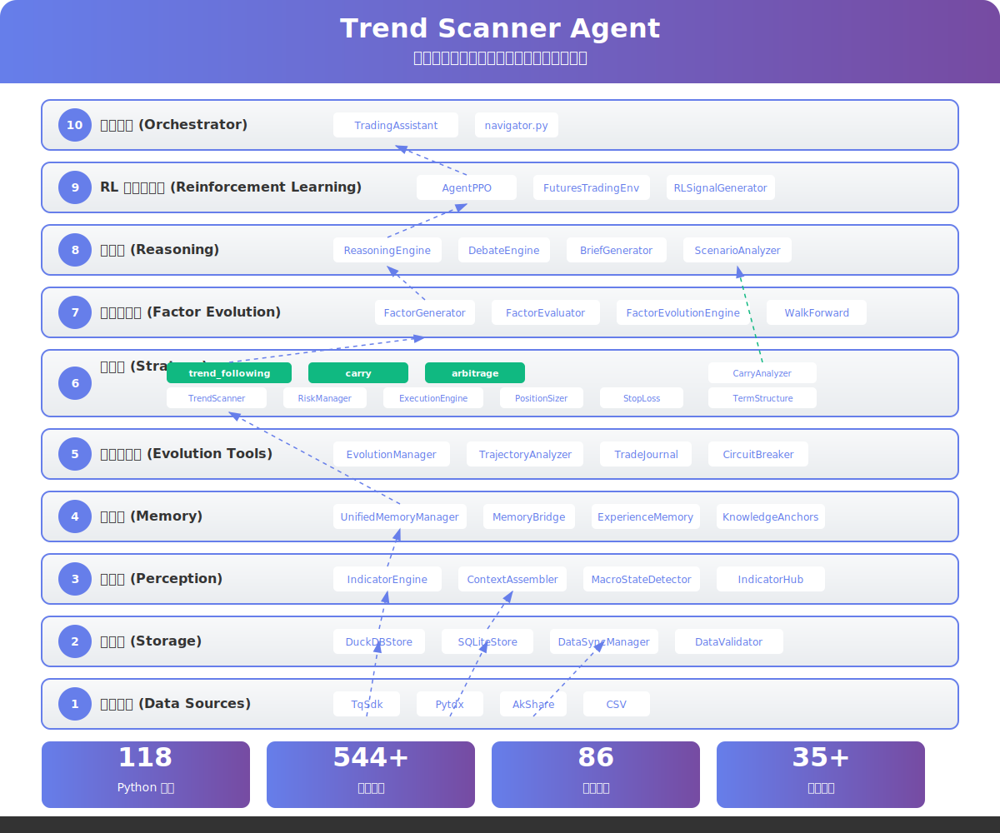

# QuantNova

> 推理重于规则的量化交易决策辅助系统 - 简化架构 v2.1.0

**新用户请查看 [用户手册](docs/USER_GUIDE.md)** | **版本历史见 [CHANGELOG](docs/CHANGELOG.md)** | **架构总览见 [系统架构](docs/system_architecture_overview.md)**

## 一句话概括

QuantNova 是一个支持期货和证券双市场的量化交易决策辅助系统，通过 AI 辩论和自优化机制，为交易提供智能决策支持。

## 核心理念

**以人为本，推理为魂，规则为果。**

## 系统运行原则

| 原则 | 说明 |
|------|------|
| **数据第一原则** | 绝对禁止使用模拟数据，分析必须使用真实数据 |
| **辩论验证原则** | 所有交易建议必须经过多方辩论才可以向用户提交 |
| **自优化原则** | 多空判断方法需要系统自优化，而不是用初始默认的方法 |

## 架构特点（简化后）

```
核心闭环：扫描 → 推理 → 辩论 → 风控
├── 期货子系统（TqSdk）
├── 证券子系统（通达信MCP）
├── 推理引擎 + 辩论引擎
├── 因子评估
├── 指标计算
├── 基本面分析
├── 风控模块
└── 记忆系统
```

**简化成果**：
- 文件数：168 → 104（减少38%）
- 代码行数：58,734 → 41,973（减少28.5%）

---

## 快速开始

```bash
git clone https://github.com/CTAAgents/QuantNova.git
cd QuantNova
pip install -r requirements.txt

# 数据同步
python tools/core/sync_data.py sync --days 120

# 运行扫描
python tools/core/scan_opportunities.py --output text --save

# Reasoner深度分析
python tools/core/scan_opportunities.py --reasoner --output text --save

# 因子评估
python tools/core/scan_opportunities.py --evaluate-factors
```

---

## 系统架构



### 层级架构（10层）

| 层级 | 名称 | 模块 |
|------|------|------|
| Layer 1 | 指标计算层 | indicators/ |
| Layer 2 | 基本面分析层 | fundamental/ |
| Layer 3 | 推理层 | reasoning/ |
| Layer 4 | 风控层 | risk/ |
| Layer 5 | 期货子系统 | futures/ |
| Layer 6 | 证券子系统 | securities/ |
| Layer 7 | 因子评估层 | evolution/ |
| Layer 8 | 数据层 | core/data/ |
| Layer 9 | 记忆层 | core/memory/ |
| Layer 10 | 配置层 | core/config/ |

**详细架构请查看** [层级架构文档](docs/architecture_layers.md)

### 数据源

| 市场 | 首选 | 第二 |
|------|------|------|
| 期货 | TqSdk | 通达信MCP |
| 证券 | 通达信MCP | NeoData |
| 基本面 | AKShare | 通达信MCP |

---

## Davey 框架

基于 Kevin J. Davey《构建盈利的算法交易系统》的风控模块：

| 模块 | 文件 | 功能 |
|------|------|------|
| 蒙特卡洛模拟 | `scripts/tools/monte_carlo.py` | 交易重排→破产概率/置信区间/最差情景 |
| 策略孵化 | `scripts/tools/strategy_incubator.py` | 实盘数据验证3-6个月 |
| 熔断机制 | `scripts/evolution_tools/circuit_breaker.py` | 策略级熔断（最大亏损/回撤/连续亏损） |
| 组合管理 | `scripts/strategies/strategy_portfolio.py` | 策略权重优化/相关性控制/分散化 |

---

## CLI 使用手册

```bash
# 日常扫描
python tools/core/scan_opportunities.py --output text --save

# Reasoner深度分析
python tools/core/scan_opportunities.py --reasoner --output text --save

# 因子评估
python tools/core/scan_opportunities.py --evaluate-factors

# 数据同步
python tools/core/sync_data.py sync --days 120
```

---

## 工作流

### 日常扫描

```
数据同步 → 指标计算 → 信号生成 → 辩论验证 → 风控检查 → 输出简报
```

### 因子进化

```
因子评估 → 因子门控 → 进化优化 → 经验记忆
```

### 自优化闭环

```
交易执行 → 结果记录 → 轨迹分析 → 故障归因 → LLM反思 → 规则优化
```

---

## 测试

```bash
python -m pytest tests/ -v
```

**测试状态**: 659+ 个测试全部通过

---

## 相关文档

| 文档 | 说明 |
|------|------|
| [本地部署指南](DEPLOY.md) | 安装、配置、开机自启动 |
| [系统架构](docs/system_architecture_overview.md) | 架构总览 |
| [层级架构](docs/architecture_layers.md) | 10层架构详解 |
| [全景档案](docs/quantnova_system_overview.md) | 系统全景 |
| [用户手册](docs/USER_GUIDE.md) | 使用指南 |
| [版本历史](docs/CHANGELOG.md) | 变更记录 |
| [开发规范](docs/CONTRIBUTING.md) | 代码风格 |
| [测试文档](docs/TESTING.md) | 测试覆盖 |
